# 🏛️ Semantic Git Archaeologist (MCP Server)

> **Grant your AI agents "Historical Memory" and Intent Recognition.**

**Semantic Git Archaeologist** is a specialized Model Context Protocol (MCP) server that enables LLMs to analyze not just *what* code changed, but *why*. By combining `GitPython` with the reasoning capabilities of **Gemini 2.5 Flash**, it maps code risks, explains legacy decisions, and detects bug patterns rooted in history.

---

## 📉 The Problem
Standard AI coding agents operate in the "now." They see the current state of the code but lack context. Tools like `git blame` tell you *who* changed a line, but they don't explain:
* **Why** a weird logic fix was introduced 3 years ago.
* **Where** the architectural hotspots and fragile files are.
* **How** functionality has evolved over time.

## ✨ The Solution
This tool bridges the gap between raw Git history and semantic reasoning. It acts as an **archaeologist**, digging through commit diffs to surface:
1.  **Semantic Analysis:** The "Intent" behind changes.
2.  **Bug Detective:** Patterns of past fixes to prevent regressions.
3.  **Risk Mapping:** Identification of high-churn, fragile modules.

---

## 🏗️ Architecture

This project exposes Git history to LLM clients (like Cursor, Claude Desktop, or Windsurf) via the MCP protocol.

```mermaid
graph LR
    Client[🖥️ LLM Client] -->|MCP Protocol| Server[⚙️ MCP Server]
    Server -->|GitPython| Repo[(📂 Git Repository)]
    Server -->|Reasoning| Gemini[✨ Gemini 2.5 Flash]
    Gemini -.->|Semantic Insights| Server
    Server -.->|Structured Context| Client
```



## 🚀 Key Features
- 🕵️‍♂️ Semantic Analysis: Translates complex diffs into human-readable narratives explaining the "Why".
- 🔥 Hotspot Detection: Identifies files with high churn and mixed responsibilities.
- 🧱 Fragility Assessment: Explains why specific files are prone to breaking (e.g., tight coupling, async complexity).
- 🧠 Architectural Memory: Provides context that standard generic LLMs miss.

## 📸 See it in Action

### 1. The Result: Rich Artifacts
The agent analyzes the code and generates visual, structured reports instantly inside Claude.
*(Notice the "Critical Risk" warning generated from historical analysis)*


### 2. The Process: Autonomous Reasoning
Watch the agent chain multiple tools (`analyze_code_hotspots`, `get_file_evolution`) to diagnose complex architectural issues without human intervention.


### 3. Under the Hood: Full MCP Support
Built with robust protocol compliance, verifiable via the official MCP Inspector.


## 🛠️ Tech Stack
- Core: Python 3.10+
- Protocol: FastMCP (Model Context Protocol)
- Git Engine: GitPython
- AI Engine: Google Gemini 2.5 Flash API

## 📦 Available Tools
When connected to an MCP client, the following tools become available:

| Tool Name | Description |
|-----------|------------|
|get_recent_commits|Retrieves structured metadata for recent commits.|
|analyze_file_evolution|Traces how a specific file's logic has changed over time.|
|analyze_code_hotspots|Identifies frequently changing areas and calculates risk scores.|
|analyze_commit_semantics|Generates a semantic explanation of a specific commit diff.|

## 📌 Example: Code Hotspot Analysis
**Input (MCP Tool Call):**

```python
analyze_code_hotspots("AgCloud")
```

**Output (LLM Reasoning Excerpt):**
"The sensor-related GUI modules exhibit high churn due to rapid feature expansion. These files combine presentation logic, domain state, and asynchronous data flows."

**Identified Risks:**
- 🔴 High Change Frequency: Top 5% of modified files.
- ⚠️ Mixed Responsibilities: UI + Domain Logic coupling.
- 🔄 Async Complexity: Race conditions detected in past fixes.

## ⚙️ Setup & Usage

### 1. Prerequisites
- Python 3.10 or higher
- A Google Gemini API Key

### 2. Installation
```bash
# Clone the repository
git clone https://github.com/yourusername/semantic-git-archaeologist.git
cd semantic-git-archaeologist

# Install dependencies
pip install -r requirements.txt
```

### 3. Running the Server
Set your environment variables and start the server:

```bash
export REPO_PATH=/path/to/target/repo
export GEMINI_API_KEY=your_gemini_key

# Run the MCP server
python main.py
```

## 📁 Documentation & Demos

Don't just take our word for it. See the **Semantic Git Archaeologist** in action on a real legacy repository (`AgCloud`).

### 1. 🕵️‍♂️ [Full Process Transcript](docs/process_demonstration.md)
**Start here!** See a raw "Anatomy of an Investigation" - how the agent plans, executes tools, finds bugs, and reasons about code history.

### 2. Generated Artifacts
The following documents were **automatically generated** by the tool during the session:
* 🛡️ **[Pre-Change Developer Briefing](docs/artifacts/sensor_logic_briefing.md)** - A warning report generated for a developer before touching sensitive code.
* 🏛️ **[Sensor GUI Evolution Analysis](docs/artifacts/sensor_gui_evolution.md)** - An explanation of why the code is written the way it is.


## 🔮 Future Work
- [ ] Support for multiple LLM providers (OpenAI, Anthropic).
- [ ] Cross-repository comparative analysis.
- [ ] Vector-based long-term architectural memory (RAG).
- [ ] Direct GitHub API integration for cloud analysis.
